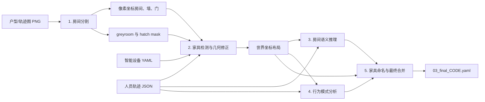

# ymj_TS：家庭空间布局语义重建

`ymj_TS` 是一个研究型家庭空间布局重建系统。它融合扫地机器人户型/轨迹图、智能设备坐标和人员停留轨迹，输出统一世界坐标下的房间与家具布局 YAML，并提供评估、基线对比、消融实验、多轮稳定性测试和噪声鲁棒性实验。

项目的核心思路是：

- 用传统计算机视觉完成房间分割和高召回家具候选检测；
- 用受限动作协议让 LLM 修正家具几何，而不是任意重画布局；
- 用智能设备、人员活动、房间连通性和几何约束推断房间类型与家具名称；
- 用确定性规则保护智能设备名称、约束家具词表并修复明显重叠；
- 在预测冻结后，使用独立评估器读取 Ground Truth，分别报告绝对坐标和房间内对齐两套结果。

> 本仓库是实验研究代码，不是通用生产服务。默认数据和部分阈值针对编号为 `0622` 的样例住宅；迁移到其他户型时，应重新检查尺度标定、图像灰度语义、设备命名和家具词表。

## 系统概览



主流程由 [main.py](main.py) 调用 [pipeline.py](pipeline.py) 编排，共五个阶段：

1. **房间分割**：Hough 线检测、网格合并、门检测和房屋边界提取，生成像素坐标布局；同时生成三值灰度图和 hatch 阴影掩码。
2. **家具检测与坐标统一**：从 hatch 阴影和机器人轨迹闭环提取候选框，完成融合去重、LLM 动作修正、智能设备匹配，再将像素坐标转换为世界坐标。
3. **房间类型推理**：结合 LLM 输出、智能设备优先级、行为模式、连通性、面积和阳台/卫生间等确定性规则推断房间类型。
4. **行为模式分析**：按房间汇总人员停留轨迹，通过 LLM 生成主要活动、高频区域和时段模式，作为家具命名上下文。
5. **家具命名与合并**：保护已匹配的智能设备名称，对其余家具执行受限词表与几何上下文命名，最后修复明显重叠并写出最终 YAML。

行为分析结果当前只在内存中参与后续推理，**不会写入最终 YAML**。最终文件也不保留 LLM 的置信度字段。

## 核心方法

### 房间分割

[photo2yaml/run_seg.py](photo2yaml/run_seg.py) 将输入图转为灰度后执行墙体阈值化、形态学处理和 Hough 直线检测，再根据墙线网格生成房间、门和坐标转换元数据。主要中间产物包括：

- `greyroom.png`：严格三值图，墙体为 `0`、地板为 `128`、机器人轨迹为 `255`；
- `hatch_mask.png`：通过 Gabor 滤波检测的斜线阴影区域；
- `room_final.png`：房间和门的分割可视化；
- `01_seg_pixel_{code}.yaml`：房间、墙、门及 `SCALE/bl_x/bl_y` 元数据。

### 家具检测

[agents/furniture_detection_agent.py](agents/furniture_detection_agent.py) 使用两个互补候选源：

| 候选源 | 方法 | 作用 |
| --- | --- | --- |
| Hatch 阴影 | 连通域与最大内接矩形分解 | 检测规则、阴影明显的家具区域 |
| 轨迹闭环 | 从三值图提取机器人轨迹包围区域 | 补充阴影较弱或形状不规则的候选 |

候选经过尺寸过滤、IoU 去重、结构特征标注和确定性合并后交给 LLM。默认受限协议只允许对已有候选执行 `keep`、`delete`、`merge` 和 `adjust`；hatch 候选在受限模式下受保护，不能被 LLM 删除。Free-form 和 Direct LLM 仅用于消融实验。

智能设备坐标随后与检测框匹配。已识别的设备名会在家具命名阶段受到保护，不会被重新命名。

### 房间与家具语义

- [agents/room_agent.py](agents/room_agent.py) 使用 `temperature=0.0` 的 LLM 输出，并以设备优先级、阳台条件、行为、连通性、卫生间模式和缺失类型补全规则进行验证与修复。
- [agents/behavior_agent.py](agents/behavior_agent.py) 为各房间生成 `main_activities`、`frequent_areas` 和 `time_based_patterns`。
- [agents/furniture_naming_agent.py](agents/furniture_naming_agent.py) 结合房间类型、允许词表、家具尺寸/形状、位置邻接、设备上下文和行为模式命名家具，并应用确定性几何规则。
- [config/smart_devices.yaml](config/smart_devices.yaml) 定义设备到房间类型的映射与优先级。
- [config/furniture_allowed.yaml](config/furniture_allowed.yaml) 定义各房间类型允许使用的家具名称。

## 环境与安装

仓库当前没有 `requirements.txt`、`pyproject.toml` 或版本锁文件。下面的依赖列表根据当前源码导入整理，建议使用独立虚拟环境和 Python 3.10 或更高版本：

```powershell
python -m venv .venv
.\.venv\Scripts\Activate.ps1
python -m pip install --upgrade pip
python -m pip install opencv-python numpy PyYAML python-dotenv pydantic langchain-core langchain-openai scikit-learn matplotlib Pillow
```

如需使用 `baselines/compare_baselines.py --excel` 导出 Excel，还需安装：

```powershell
python -m pip install openpyxl
```

Linux/macOS 下将虚拟环境激活命令替换为：

```bash
source .venv/bin/activate
```

### LLM 配置

在项目根目录创建 `.env`：

```dotenv
FURNITURE_API_KEY=your-api-key
FURNITURE_BASE_URL=https://your-openai-compatible-endpoint/v1
```

- `FURNITURE_API_KEY` 是主入口和实验脚本要求的统一凭证。
- `FURNITURE_BASE_URL` 可选；不设置时使用 `langchain-openai` 的默认端点行为。
- 当前所有 Agent 和 VLM 基线由 [llm_config.py](llm_config.py) 强制统一使用 `gpt-5.6-terra`，命令行不能切换到其他模型。
- 家具检测和 VLM 基线会发送图像，因此所配置的模型端点需要支持相应的视觉输入格式。
- `.env` 已被 `.gitignore` 忽略，不应提交真实密钥。

注意：`main.py` 在解析命令行参数之前检查 `FURNITURE_API_KEY`。因此即使运行 `--help` 或 `--skip-agents`，当前实现仍要求环境中存在该变量。

## 快速开始

所有命令均应从项目根目录执行。

### 使用仓库样例

```powershell
python main.py --code 0622
```

默认解析规则如下：

| 参数 | 默认值/规则 |
| --- | --- |
| `--code` | `0622` |
| `--image` | `input/photo/room_{code}.png` |
| `--smart-device` | `input/Smart_device/smartDevice_{code}.yaml` |
| `--trajectory` | 从 `input/traj/{code}/` 中选择文件体积最大的 JSON |
| `--output-dir` | `output/{code}/` |

图像不存在时程序直接退出；智能设备或轨迹文件不存在时，主入口会警告并在缺少该模态的情况下继续。

### 显式指定输入

```powershell
python main.py --code 0622 --image input/photo/room_0622.png --smart-device input/Smart_device/smartDevice_0622.yaml --trajectory input/traj/0622/0622-Engineer-all_trajectory.json --output-dir output/0622
```

### 复用已有分割

```powershell
python main.py --code 0622 --skip-seg
```

`--skip-seg` 要求以下文件已经存在：

```text
output/0622/yaml/01_seg_pixel_0622.yaml
```

家具检测还会优先复用 `output/0622/masks/greyroom.png` 和 `hatch_mask.png`。若掩码不存在，程序会退回原始图像并跳过缺失的 hatch 来源，结果可能与完整流程不同。

### 只运行分割路径

```powershell
python main.py --code 0622 --skip-agents
```

当前 `--skip-agents` 的实现会跳过家具检测、房间推理、行为分析和家具命名，并将像素坐标的分割 YAML 复制为 `02_furniture_world_*.yaml` 和 `03_final_*.yaml`。因此这些文件只是兼容占位结果，不能视为完成了坐标统一或语义重建。

## 输入格式

### 1. 户型/轨迹图

默认命名为 `input/photo/room_{code}.png`。图像需要能通过当前阈值和 Gabor 参数分离出墙体、可行驶地面、机器人轨迹及 hatch 阴影。不同 APP 配色、截图缩放、压缩或墙体灰度可能需要调整 [photo2yaml/run_seg.py](photo2yaml/run_seg.py) 和 [photo2yaml/extract_hatch.py](photo2yaml/extract_hatch.py) 中的阈值。

### 2. 智能设备 YAML

坐标为世界坐标中的点位置：

```yaml
house:
  size: {x: 63, y: 137}
  furniture:
    - name: Refrigerator
      id: Refrigerator_001
      position: {x: 57, y: 104}
    - name: Washing Machine
      id: Washing_Machine_001
      position: {x: 49, y: 58}
```

设备名称应与 `config/smart_devices.yaml` 中的名称一致，否则不会获得设备类型先验和名称保护。

### 3. 人员轨迹 JSON

项目样例使用停留点数组：

```json
[
  {
    "id": 1,
    "start_time": "2025-05-31 05:30:00",
    "end_time": "2025-05-31 05:30:30",
    "duration": 0.5,
    "center_position": {"x": 52.5, "y": 34.5},
    "fluctuation_radius": 0.1
  }
]
```

样例数据中的 `duration` 以分钟表示。管线会优先根据 `start_time/end_time` 校验并转换为秒，供房间和行为 Agent 使用；缺少时间戳时，未显式标记为秒的 `duration` 也按分钟处理。家具检测阶段直接读取原始轨迹，并按项目数据约定将 `duration` 用作分钟值。

### 坐标与单位

| 坐标系 | 原点 | Y 轴方向 | 用途 |
| --- | --- | --- | --- |
| 图像/像素坐标 | 图像左上角 | 向下 | 分割及 CV 候选 |
| 世界坐标 | 房屋左下角 | 向上 | 智能设备、人员轨迹、最终 YAML |

项目实际按 **dm（分米）** 使用世界坐标，`1 dm = 10 cm`。部分旧注释或日志可能显示 `m`，但设备尺寸、评估阈值和样例房屋尺寸均按 dm 解释。

转换元数据位于分割 YAML 的 `metadata`：

```yaml
metadata:
  SCALE: 0.08258  # dm/px
  bl_x: 49        # 房屋左下角的像素 x
  bl_y: 1686      # 房屋左下角的像素 y
```

核心换算关系为：

```text
world_x = (pixel_x - bl_x) * SCALE
world_y = (bl_y - pixel_y) * SCALE
```

### 新户型的尺度标定

`photo2yaml/run_seg.py` 当前默认使用样例住宅高度 `137 dm` 估算 `SCALE`：

```text
REF_LENGTH = 137.0
REF_DIM = "height"
```

`main.py`/`Pipeline.run_seg_step()` 没有向分割子进程转发 `--scale`、`--ref` 或 `--ref-on`。因此直接运行完整主流程处理新户型前，需要修改分割脚本中的默认参考长度/方向，或扩展管线将这些参数向下传递。否则最终世界坐标会按错误比例缩放。

分割脚本自身支持独立标定，例如：

```powershell
python photo2yaml/run_seg.py input/photo/room_demo.png output/demo --ref 120 --ref-on height
python photo2yaml/run_seg.py input/photo/room_demo.png output/demo --scale 0.08
```

独立执行时输出文件名为 `floorplan_real.yaml`；它不会自动完成主管线中的重命名和房间 `id` 注入，不能未经处理就当作 `--skip-seg` 的标准输入。

## 输出结构

完整运行的主要输出为：

```text
output/{code}/
├── yaml/
│   ├── 01_seg_pixel_{code}.yaml       # 像素坐标房间分割
│   ├── 02_furniture_world_{code}.yaml # 世界坐标房间与家具几何
│   ├── 03_final_{code}.yaml           # 最终房间类型与家具名称
│   └── masks/                         # 家具检测热度图和总览图
├── masks/
│   ├── greyroom.png
│   ├── greyroom_palette.png
│   └── hatch_mask.png
└── viz/
    ├── wall.png
    └── room_final.png
```

根据执行的实验，还可能生成：

```text
output/{code}/
├── baselines/       # VLM 与 CV-only 预测
├── evaluation/      # 评估文本、JSON 或 Excel
├── ablation/        # 各消融变体的独立输出
├── multi_run_eval/  # 多轮运行结果
└── noise_robustness/# 噪声实验中间结果
```

`output/` 被 `.gitignore` 忽略，不会默认纳入版本控制。

### 最终 YAML

`03_final_{code}.yaml` 的主体结构如下：

```yaml
house:
  size: {x: 64.58, y: 137.0}
  rooms:
    - name: living_room
      position: {x: 10.24, y: 59.21, width: 33.53, height: 62.27}
      walls: {top: true, right: true, bottom: true, left: true}
      doors:
        - {id: door2, x: 43.77, y: 86.01}
      furniture:
        - id: living_room_fur1
          name: sofa
          position: {x: 10.57, y: 91.0, width: 6.19, height: 30.14}
metadata:
  SCALE: 0.08258
  bl_x: 49
  bl_y: 1686
```

最终合并阶段会将内部房间 `id` 替换为语义化的 `name`，并按房间内顺序重写家具 ID。因此不同房间可以出现相同形式的家具 ID，例如多个卧室都可能包含 `bedroom_fur1`；不要将最终家具 ID 当作全屋全局唯一键。

## 可视化

将最终 YAML 渲染为 PNG：

```powershell
python visualize_layout.py --code 0622
```

显式指定输入、输出和 DPI：

```powershell
python visualize_layout.py --input output/0622/yaml/03_final_0622.yaml --output output/0622/viz/floorplan_render_0622.png --dpi 200
```

该脚本使用 Matplotlib 的无界面后端，不需要打开 GUI。

## 评估

[evaluation.py](evaluation.py) 在预测文件已经生成并冻结后读取 Ground Truth。生成阶段不应读取 `GT/`。

### 单个住宅

```powershell
python evaluation.py --code 0622
```

等价的显式命令：

```powershell
python evaluation.py --pred output/0622/yaml/03_final_0622.yaml --gt GT/layout_0622.yaml --output output/0622/evaluation/evaluation_0622.txt
```

### 批量评估

```powershell
python evaluation.py --pred_dir output/0622/yaml --gt_dir GT
```

批量模式按文件名中的编码匹配预测与 GT；单文件模式默认将报告保存到 `output/{code}/evaluation/evaluation_{code}.txt`。

### 两套匹配协议

| 协议 | 含义 |
| --- | --- |
| Global | 所有家具按预测的绝对世界坐标统一进行匈牙利匹配 |
| Aligned | 先匹配房间，再把每对预测房间平移到 GT 房间原点后，在房间内匹配家具 |

Aligned 用于分离房间整体平移误差与家具相对布局误差。两套协议必须分别比较，不能把 Global 方法与 Aligned 方法横向排序。

### 主要指标

| 指标 | 定义 |
| --- | --- |
| Room Type Accuracy | 房间定位匹配且类型正确的数量 / GT 房间数 |
| Room F1 | 由正确房间语义匹配计算的 Precision、Recall 和 F1 |
| Localization F1 | 家具匈牙利匹配后，`IoU > 0.2` 视为定位 TP |
| Semantic F1 | 同时满足 `IoU > 0.2` 和名称正确的端到端家具语义 F1 |
| Conditional FNA | 已定位 TP 中名称正确的比例，仅用于错误归因 |
| Centroid F1/Recall | 家具质心距离不超过 `5 dm` 时视为命中 |
| Legacy CLS | `0.45 × Conditional FNA + 0.35 × Localization F1 + 0.20 × Room Type Accuracy` |

Legacy CLS 的权重未经验证，代码中仅作为兼容性和探索性指标。主结果应优先报告 Room F1、Localization F1 和 Semantic F1。

评估器还按 GT 家具面积分层：`small < 50 dm²`、`medium 50–200 dm²`、`large >= 200 dm²`。

## 基线对比

[baselines/compare_baselines.py](baselines/compare_baselines.py) 比较四种方法：

1. VLM Zero-shot；
2. VLM Chain-of-Thought；
3. CV-Only；
4. Ours。

运行前必须先生成本项目的最终预测，因为对比脚本**不会自动运行 Ours 主流程**：

```powershell
python main.py --code 0622
python baselines/compare_baselines.py --code 0622
```

复用已有 VLM 预测、不重新调用 VLM：

```powershell
python baselines/compare_baselines.py --code 0622 --skip-vlm
```

批量对比并导出 Excel：

```powershell
python baselines/compare_baselines.py --codes 0622,0701 --excel
```

输出位于 `output/{code}/evaluation/comparison_{code}.txt`；多住宅结果还会生成 `comparison_summary.txt`。只有当本次 VLM 生成成功或显式使用 `--skip-vlm` 时，脚本才会评估对应的预测文件。

绘制对比图：

```powershell
python baselines/plot_comparison.py --code 0622
```

也可直接运行 VLM 基线：

```powershell
python baselines/vlm_baseline.py --code 0622 --image input/photo/room_0622.png --devices input/Smart_device/smartDevice_0622.yaml --trajectory input/traj/0622/0622-Engineer-all_trajectory.json --method both
```

## 消融实验

[baselines/ablation_experiments.py](baselines/ablation_experiments.py) 的默认命令只运行聚焦的 `core` 模块移除实验：

```powershell
python baselines/ablation_experiments.py --code 0622
```

可选实验组如下：

| 组 | 主要变体 |
| --- | --- |
| `core` | Full、移除房间语义、行为语义、家具命名、家具几何修正、7 层房间优先级 |
| `modal` | Layout Only、+ Device、+ Trajectory、Full |
| `hybrid` | CV-only、Free-form LLM、Direct LLM Generation、Constrained |
| `detection` | Full Dual-source、No Hatch、No Trajectory Loop |
| `reasoning` | Full、No 7-Layer Priority、No Behavior Prior、No Allowed List、No Shape Constraint |
| `module` | 兼容旧实验的补充管线组件移除组 |

指定一个或多个组：

```powershell
python baselines/ablation_experiments.py --code 0622 --group modal --group hybrid
```

`--group all` 运行历史四组 `modal`、`hybrid`、`detection`、`reasoning`，不包含默认的 `core`；如需补充组，可再加 `--group module`。

```powershell
python baselines/ablation_experiments.py --code 0622 --group all --group module
```

复用已有分割：

```powershell
python baselines/ablation_experiments.py --code 0622 --skip-seg
```

结果保存到 `output/{code}/evaluation/ablation_results_{timestamp}.txt`，每个变体的完整产物位于 `output/{code}/ablation/`。消融表同时报告 Global/Aligned 指标、Semantic FDR，以及在最终词表修复之前计算的 Protocol Violation Rate。

## 多轮与鲁棒性实验

### 多轮稳定性

默认每个住宅运行 5 次，并默认复用确定性的房间分割：

```powershell
python baselines/multi_run_evaluation.py --code 0622 --runs 5
```

强制每轮重新分割：

```powershell
python baselines/multi_run_evaluation.py --code 0622 --runs 5 --no-skip-seg
```

结果保存为 `output/{code}/evaluation/multi_run_eval_{timestamp}.txt` 和 `.json`。

### 噪声鲁棒性

```powershell
python baselines/noise_robustness.py --code 0622
```

实验包括：

- `b1`：智能设备坐标的相关扰动；
- `b2`：人员轨迹时间下采样和天级截断；
- `b3`：JPEG、Gamma、噪声和模糊等图像退化。

只运行指定组：

```powershell
python baselines/noise_robustness.py --code 0622 --group b1 --group b3
```

绘图：

```powershell
python baselines/plot_noise_robustness.py --code 0622
```

## 项目结构

```text
.
├── main.py                         # 推荐的主入口
├── pipeline.py                     # 五阶段管线与消融开关
├── llm_config.py                   # 统一模型、API key 和 endpoint
├── evaluation.py                   # Global/Aligned 独立评估器
├── visualize_layout.py             # 最终 YAML 可视化
├── agents/
│   ├── furniture_detection_agent.py # 双源候选、LLM 几何修正、设备匹配
│   ├── room_agent.py               # 房间类型推理与规则修复
│   ├── behavior_agent.py           # 行为模式分析
│   ├── furniture_naming_agent.py   # 家具命名与确定性约束
│   ├── coordinate_converter.py     # 像素/世界坐标转换
│   ├── data_models.py              # Pydantic 输出模型
│   └── prompts.py                  # LLM Prompt 与构造函数
├── photo2yaml/
│   ├── run_seg.py                  # 房间、门、三值图与尺度元数据
│   └── extract_hatch.py            # Gabor hatch 阴影提取
├── config/
│   ├── smart_devices.yaml          # 设备房间映射和优先级
│   └── furniture_allowed.yaml      # 房间家具允许词表
├── baselines/
│   ├── compare_baselines.py        # 四方法公平对比
│   ├── vlm_baseline.py             # Zero-shot 与 CoT VLM
│   ├── cv_only_baseline.py         # 无 LLM 基线
│   ├── ablation_experiments.py     # 消融实验
│   ├── multi_run_evaluation.py     # 多轮均值/方差
│   ├── noise_robustness.py         # 三组噪声实验
│   ├── plot_comparison.py          # 基线对比图
│   └── plot_noise_robustness.py    # 鲁棒性图
├── input/                          # 样例图像、设备和轨迹
├── GT/                             # 仅用于独立评分的人工标注
├── tests/                          # unittest 协议与规则测试
└── realroom/                       # 真实房间参考图
```

## 测试

运行全部离线单元测试：

```powershell
python -m unittest discover -s tests -v
```

检查所有 Python 文件是否可编译：

```powershell
$files = rg --files -g "*.py"
python -m py_compile $files
```

测试主要覆盖评估协议、消融边界、VLM 生成事务、轨迹时长归一化、统一 LLM 配置和家具命名上下文规则。端到端运行仍需要可访问的模型 API，并可能产生调用费用。

## 已知限制

- 分割尺度默认绑定样例住宅的 `137 dm` 高度，新户型必须重新标定。
- 当前没有依赖版本锁文件，环境复现需要自行固定经验证的包版本。
- CV 阈值、设备尺寸范围和家具几何规则带有明显的数据集先验。
- `temperature=0.0` 不能保证远程模型、服务版本或供应商实现完全确定。
- `--skip-agents` 生成的是分割结果副本，不是完整世界坐标语义布局。
- 行为分析和各 Agent 置信度不写入最终 YAML，只作为管线内部证据。
- 最终家具 ID 只在单个房间内按顺序生成，不保证全屋唯一。
- 仓库当前没有 `LICENSE` 文件；对外分发或复用前应先明确许可证。
